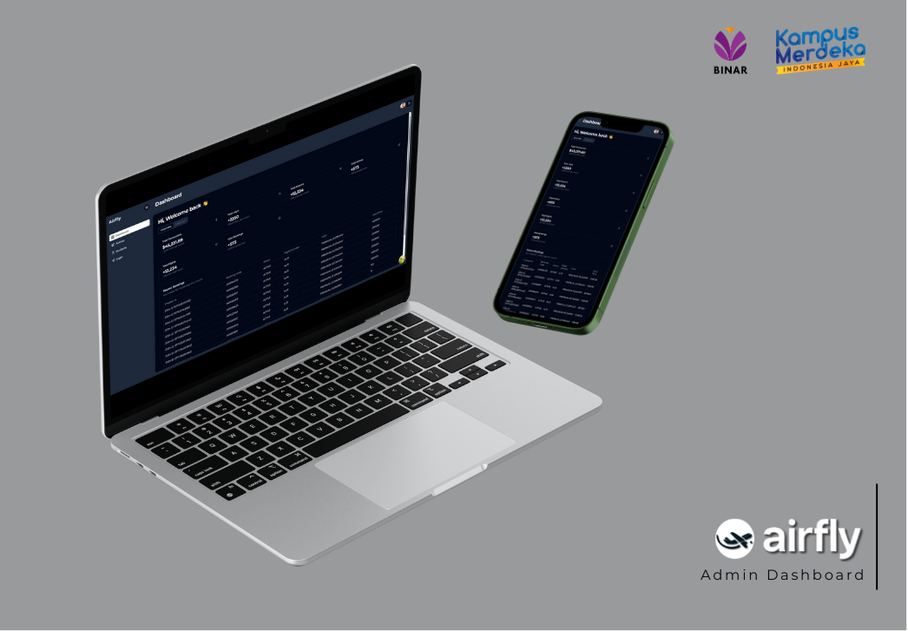

<p align="right">:sparkles:Binar KM-7 Final Project:sparkles:</p>
<h1 align="center">Admin Dashboard - AirFly </h1>
<p align="center">
<strong><a href="https://github.com/TIM1-FSW-BE-BINAR/Admin-Dashboard">✈️ Admin Dashboard</a></strong>
</p>

## 🖼️ Preview



## 👥TEAM

| Name                      | Job Description     |
| ------------------------- | ------------------- |
| Dhiya Ul Faruq (lead)     | Dashboard, Airlines |
| Michael Joenathan Darwin  | Login, Airports     |
| Naila Jinan Gaisani       | Seats, Notification |
| Muhammad Fadhillah Rahman | Flights, Discount   |

## 🎯 Project Goal

The goal of the project is to provide admin dashboard for Airfly - Airplane ticket booking Website that reliable, compact and easy to use.

## 🚩 MVP

| Output                                       |
| -------------------------------------------- |
| Admin can Create, Read, Update, Delete Items |

| Feature                                                             | Status |
| ------------------------------------------------------------------- | ------ |
| Responsive: support mobile design                                   | ✅     |
| Authentication                                                      | ✅     |
| State Management: React Hooks, Tanstack Query, Redux, Redux Toolkit | ✅     |
| Role: Admin                                                         | ✅     |
| Deployment: CloudFlare                                              | ✅     |
| GIT: Branching                                                      | ✅     |

## 📑 Backend Documentation

- [Github](https://github.com/TIM1-FSW-BE-BINAR/Backend/)
- [Swagger](https://binar.azumidev.web.id/api/v1/api-docs/)
- [Postman](https://documenter.getpostman.com/view/22814931/2sAYBUCrsH#intro)

## 💻 Technology That We Used

### Core Tech Stack:

- 
- 
- 
- 
- 
- 
- 

### Styling:

- 
- 
- 
- 

### Utility Tech Stack:

- 
- 
- 

### Deployment:

- 

## ⚙️ Installation and Setup Instructions

Clone down this repository. You will need `node` and `npm` installed globally on your machine.

Installation:

```bash
npm install
```

To Run Test Suite:

```bash
npm test
```

To Start Server:

```bash
npm start
```

To Visit Development App:

http://localhost:5173/

## 🌐 Demo Link

You can see the demo of this project here:

- [Admin Dashboard Demo](https://admin-dashboard-7tp.pages.dev/)

make sure to use the latest version of your browser.

Admin Account:

```bash
admin@unolegam.com
```

```bash
password
```

## ©️ Credits

Big thanks to Binar Academy for giving us this opportunity to learn and grow as a developer.

We also want to thank our mentor kak Fahmi and kak Mughie for their guidance and support throughout this project.

and Sat Naing who provide resusable component UI dashboard
